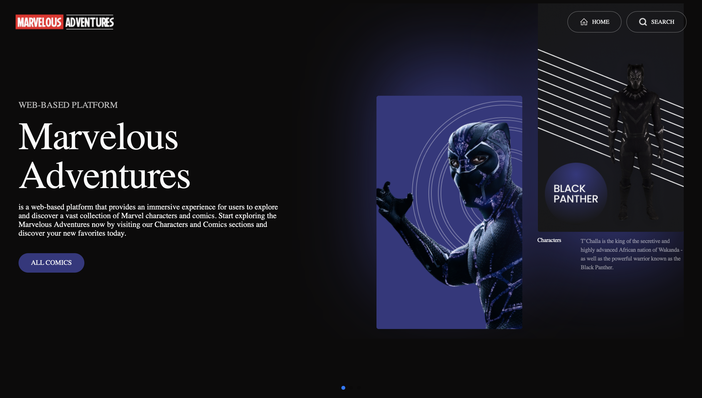
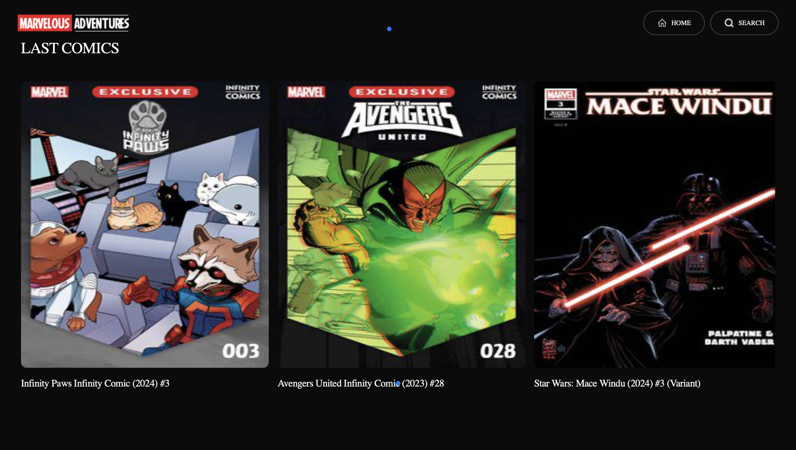
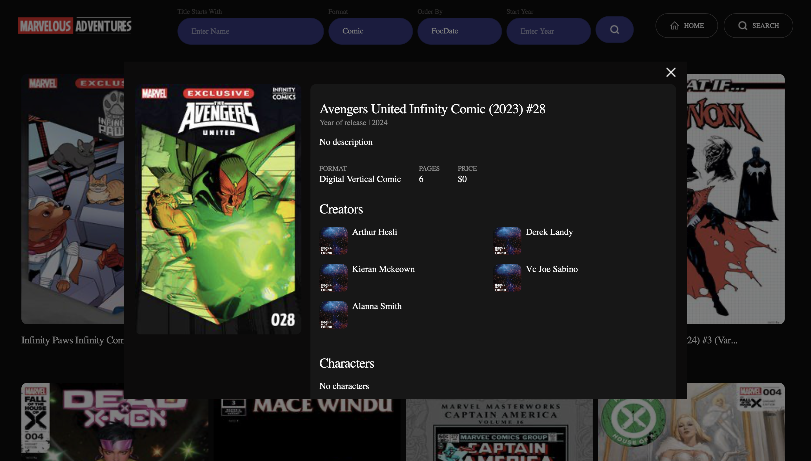

# Marvelous Adventures

*Projects for comic enthusiasts and beyond. Explore popular comics from the last week and discover familiar favorites. Dive into detailed information about each comic and its main characters. The website is crafted using React and leverages a plethora of libraries to achieve optimal results.*:stuck_out_tongue:

## Main page 

*On this page you will familiarize yourself with the site.*

## Last comics 

*Here you can see the latest comics.*

## Search page 

*On this page you will be able to find the desired comic by sorting it by the main criteria.*

## Modal 

*When you click on a comic, a modal window opens, in which you can familiarize yourself with all the necessary information.*

### Technologies used in the project

+ HTML
+ CSS
+ JavaScript
+ react
+ redux-toolkit
+ axios
+ styled-components
+ react-router-dom
+ swiper

***I hope you find your perfect car and have a perfect weekend!***:sparkles:
